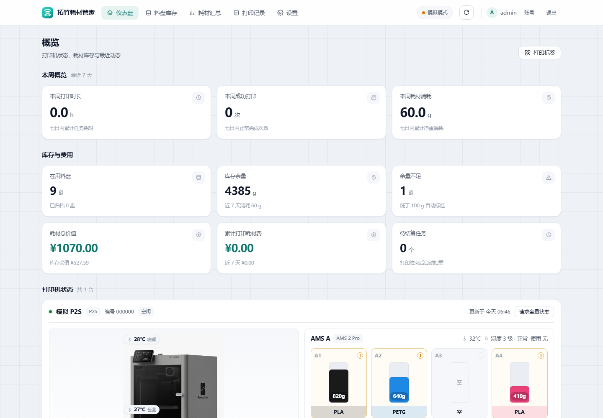
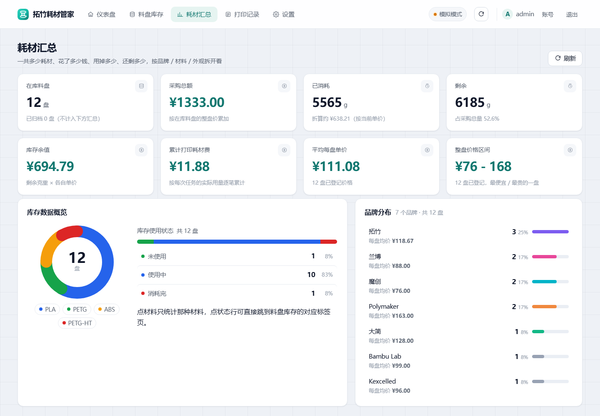
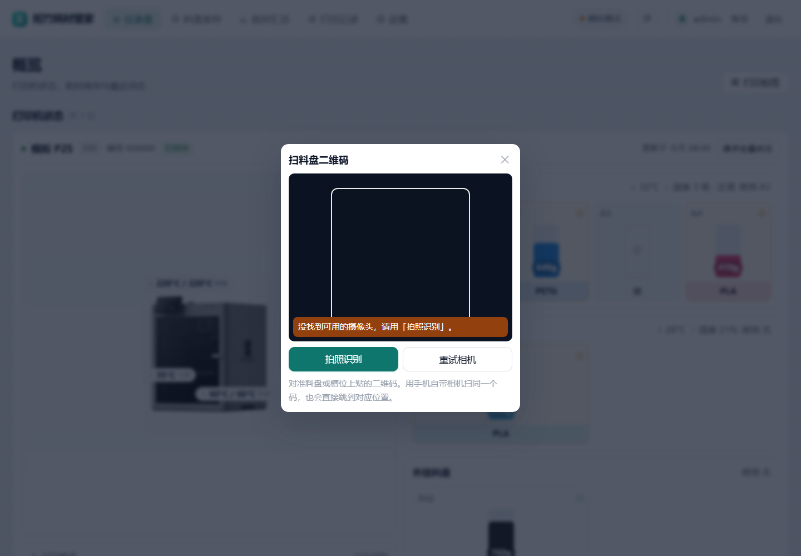
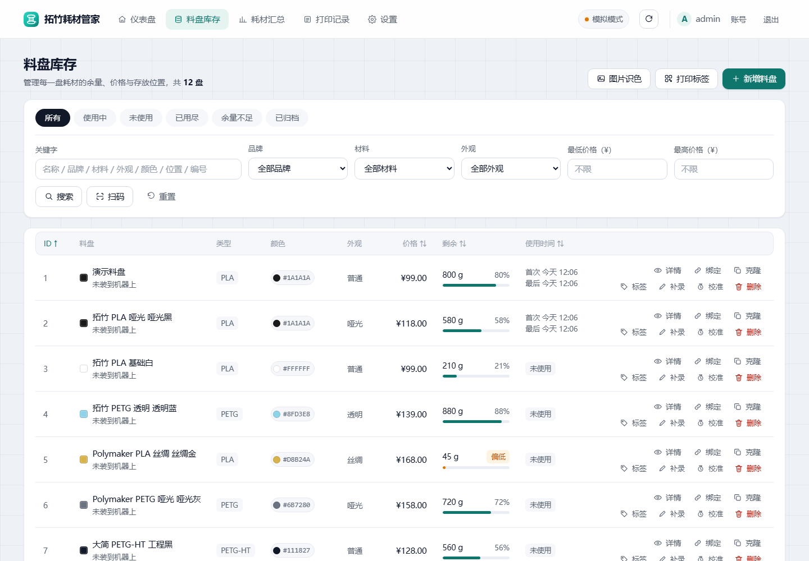
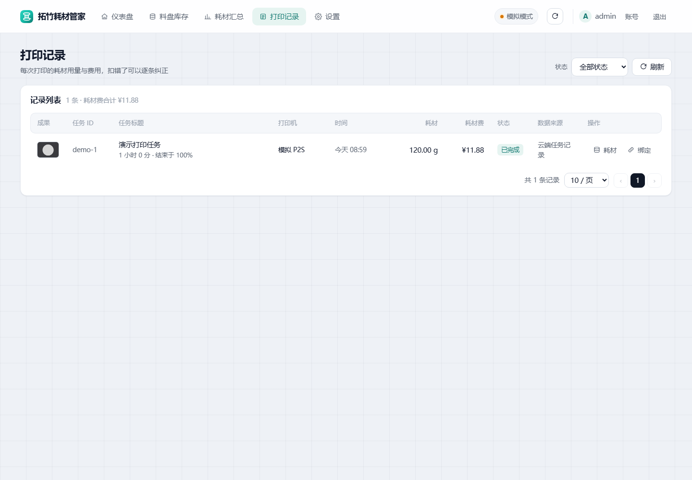

# 拓竹耗材管家 (Bambu Spool)

自托管的拓竹（Bambu Lab）3D 打印机耗材管理系统，带**打印完成自动扣重**。
一个 Docker 容器跑起来，中文界面，数据全在自己手里。

对标 [Mars Printer Hub](https://wiki.hcgl.top/) 的核心能力（AMS 槽位可视化、料盘绑定、自动扣重、使用历史），
但开源、免费、可私有部署，并且**不需要打印机和服务器在同一局域网**。



| 耗材汇总 | 手机端扫码 |
|---|---|
|  |  |

| 料盘库存 | 打印记录 |
|---|---|
|  |  |

---

## 它解决什么问题

多色打印最烦的事之一：不知道每盘料还剩多少。这个项目把这件事完全自动化——

1. 绑定拓竹账号，自动同步账号下的打印机
2. 在界面上把 **AMS 每个槽位** 绑定到**具体哪盘料**
3. 打印机开始打印 → 自动开一条任务记录
4. 打印结束 → 从拓竹云端任务历史拿到**每个槽位实际用了多少克**
5. 自动扣减对应料盘的余量，留下一条可追溯的使用流水
6. 扣错了？在料盘详情里一键把这条消耗转到另一盘料

全程不需要手动记账。

录入料盘时还内置了**品牌配色卡**：选 Polymaker 会按材料带出
Panchroma™ PLA（28 色）、Panchroma™ 哑光 PLA（52 色）、Polymaker™ PETG（24 色）
的官方色号；Kexcelled（K5 PLA 51 色 / PLA 哑光 55 色 / PETG 52 色 / PETG 哑光 22 色）、
兰博（13 个 PLA 系列 + 2 个 PETG 系列）、魔创（8 个系列 152 色：PLA / PLA 哑光 / PLA+ /
HT-PLA / PETG / PETG 哑光 / ASA / ABS，取自官方淘宝店商品 SKU）也已内置。点色块直接填名称和色值；
无法从官方确认的 HEX（Polymaker 部分色号、Kexcelled 与兰博全部、魔创全部取自官方产品图）会标注为近似值。

### 图片识色 · 找同色耗材

料盘库存页右上角的「图片识色」：拖一张照片进来（也可以选文件、Ctrl+V 粘贴，
手机端直接拍照），自动提取画面里的主要颜色，然后帮你回答两个问题——

- **库里现有的料，哪一盘最接近？** 直接按余量、存放位置列出来，告诉你该用哪盘。
- **想买新的，该买哪个品牌哪个色？** 对 4 个品牌 637 个官方色号做匹配，
  每个品牌给出它最接近的一个色，方便横向比价。

颜色支持手动微调：点击图片任意位置可以精确吸色，也能手动加色、删掉不需要的色。
匹配可以按材料、品牌过滤，色差上限（ΔE）可调；从结果里点「建料盘」
品牌、材料、色名、色值、皮重会全部预填好。

色差用的是 **CIEDE2000**（不是简单的 RGB 距离）——同样是数值差 30，
深蓝之间肉眼几乎无差、绿色之间已经明显不同，所以找同色耗材必须用感知色差。
阈值参考：ΔE < 1 看不出差别，< 2 算同色，< 4 非常接近，> 10 就明显是两种颜色了。

图像的主色提取在浏览器里完成（Canvas 聚类 + 吸管），只把最终几个色值发给后端，
所以容器不需要任何图像处理依赖，手机上也够快。

### 耗材价格与每打印费用

每盘料都能登记一个**整盘价格（¥）**，系统据此自动算清三笔账：

- **耗材总价值**：所有在用料盘的整盘价之和（你为这些料花了多少钱）。
- **库存余值**：按「单价 × 当前余量」折算的库存现值（单价 = 整盘价 ÷ 满盘净重）。
- **每次打印耗费料材的价格**：一条打印任务的「耗材费」= 各槽位用量 × 对应料盘单价之和；
  打印记录列表、任务详情都会显示，并汇总出累计打印耗材费。

未登记价格的料盘不计入任何费用汇总（单价/余值显示为「—」）。老数据（打印记录里
没有费用快照）会按当前料盘单价实时折算，所以改价后历史打印费也能跟着更新。

### 耗材汇总：一共多少料、花了多少钱、还剩多少

单独一个「耗材汇总」页，回答五件事：**一共多少盘、花了多少钱、用了多少、还剩多少、
都有哪些品牌 / 材料 / 外观**。三张表分别按**品牌**、**材料**、**外观**拆开，每行给出——

| 列 | 口径 |
|---|---|
| 盘数 | 该分组下在用料盘的盘数（已归档的不计入） |
| 满盘净重 | 各盘 `initial_weight` 之和，也就是「如果全是新的，一共多少克」 |
| 已用 / 剩余 | 各盘 `used_weight` / `remaining_weight` 之和 |
| 余量 | 剩余 ÷ 满盘净重，直接反映这个分组还剩多少 |
| 采购金额 | 各盘整盘价之和（你为这几盘料花了多少钱） |
| 余值 | 按当前单价折算的库存现值 |

排序按「盘数多的在前、同样多则剩余多的在前」，所以最常用的品牌 / 材料一眼就在第一行。
没登记价格的料盘照旧不计入金额列。

概览页顶部还有三张「本周」卡：**本周打印时长 / 本周成功打印 / 本周耗材消耗**，
统计最近 7 个自然日（含今天），并且**按你浏览器的时区切日**——东八区晚上看到的「今天」
不会被算进 UTC 的昨天。

### 料盘管理：删除、归档、品牌归一

录错了能删掉——料盘列表每行的垃圾桶按钮、或料盘详情里的「删除料盘」：

- **没有使用流水的料盘**：直接删除，不拦。
- **有使用流水的料盘**：默认先拦一道（返回 409），弹窗会告诉你这盘料有几条记录，
  确认后才会连同流水一起删。删除时会**顺手收拾干净引用关系**——清掉该料盘的槽位绑定、
  删掉它名下的使用流水、把打印任务明细里的引用置空但**保留克重**（任务本身和历史用量不受影响）。

还没用完但暂时不用的料盘，用「归档」而不是删除，它会从默认列表里隐去，统计口径也分开算。

**品牌归一**：「拓竹」和「Bambu Lab」、「Kexcelled」和「kecelled」这类中英/变体写法
在系统里只会存在一条规范名。新建、编辑料盘时自动归一，老库里已有的历史写法
**启动时自动收口一次**（幂等，自定义品牌不受影响）。这样筛选下拉框就不会出现重复项了。

**外观（表面工艺）** 和材料、颜色一样是独立字段：同样是 PLA 黑色，普通、哑光、丝绸
是三种不同的货，价格也不一样。内置 15 种预设（普通 / 亮面 / 哑光 / 磨砂 / 丝绸 / 珠光 /
金属 / 半透 / 透明 / 渐变 / 双色 / 木纹 / 碳纤 / 夜光 / 其他）：

- 新建 / 编辑料盘时是一个**可输入的下拉框**（`datalist`），既挑预设也允许自己写「电镀镜面」这种；
- 填颜色名时**自动预填**外观：「哑光黑」→ 哑光、「丝滑白」→ 丝绸、「半透明蓝」→ 半透
  （关键词顺序敏感：丝绸优先于哑光、半透优先于透明，否则「半透明」会被判成全透明）；
- 英文写法也认：matte / silk / translucent / glow / carbon / rainbow …
- 库存页的「外观」筛选跟着实际数据走，老数据里的自定义写法也能筛出来。

**自定义品牌**：除了内置的 8 个品牌，还能在设置页加自己的品牌（比如「自家作坊」）。
自定义品牌存在数据库的设置表里，**升级镜像 / 重启都不会丢**；删掉只是从下拉候选里移除，
**已经用这个品牌录好的料盘照旧保留**，需要时再加回来即可。

### 真机照片（换成你自己的机器）

设备面板左侧原来画的是一张内联 SVG 示意图。现在只要在
`app/static/printer/` 里放一张以**机型命名的照片**，它就自动换成真机照片：

```
app/static/printer/p2s.jpg     →  P2S
app/static/printer/x1c.jpg     →  X1C
app/static/printer/a1mini.png  →  A1MINI
```

文件名就是机型（大小写不敏感），**放文件即生效，不用改代码、不用重启**
（后端启动时扫这个目录，把 `{机型: 图片地址}` 交给前端）。目录里没有对应机型、
或者图片加载失败时，自动退回原来的内联 SVG 示意图，所以只有一张 P2S 照片也不会让
其它机型开天窗。喷嘴 / 仓温 / 热床三个温度浮标是实时读数，会照旧叠在照片上。

仓库里带的 P2S 照片来自拓竹官方商城的产品图，用 `scripts/build_printer_photo.py` 处理过：
裁掉商品图上的型号字、按界面展示框（240×292，输出 720×876）居中缩放、四周补上取样出来的
影棚底色，这样浮标刚好落在机器两侧而不是压在机器身上。底图（2400×2400）取自
`https://store.bblcdn.com/s7/default/a47bdb7ac6804dc78416d8901a71aba1/P2S.jpg`，
想重新生成对着下面第 2 步跑一遍即可，不必把原图留在仓库里。

想换成自己的照片（比如自己那台机器的实拍）：

```bash
# 1) 先量一下机身范围（会打印整幅 / 上半幅 / 下半幅三个外接框）
python scripts/build_printer_photo.py 我的照片.jpg --probe

# 2) 按量出来的框裁成界面展示框的尺寸
python scripts/build_printer_photo.py 我的照片.jpg app/static/printer/p2s.jpg \
    --crop 498,650,1857,2018 --canvas 720x876 --fit-width 0.86
```

如果素材上已经压了别的东西（最典型的是官方 App 截图里的温度胶囊），加 `--heal x0,y0,x1,y1`
把它修掉（可重复），脚本会用矩形上下边界做竖向线性插值补背景——影棚底的亮度基本只跟 y 有关，
插值出来的背景和周围完全一致，不会像填纯色那样留下硬边。

### 手机扫码（相机扫码 / 拍照识别）

每盘料都有自己的二维码标签，扫一下直接跳到那盘料的详情页。入口：料盘列表每行的「标签」
按钮、料盘详情里的「标签」，或顶部的「打印标签」。

扫码有三个入口，手机上都能用：库存页工具栏的「扫码」、槽位绑定弹窗里的「相机扫码」、
以及把二维码贴纸上的网址直接用**手机自带相机**扫（扫到就打开 App 并跳到对应位置）。

点「相机扫码」后的三层降级：

1. **原生解码 + 实时相机**：安卓 Chrome 有内置的 `BarcodeDetector`，最省电最快；
2. **jsQR + 实时相机**：iOS Safari 等没有 `BarcodeDetector` 的浏览器，用本地化的
   [`jsQR`](https://github.com/cozmo/jsQR)（Apache-2.0，`static/vendor/jsQR.js`）逐帧解码
   ——放本地是为了**不依赖外网 CDN**，这个应用经常跑在没有外网的内网里；
3. **拍照识别**：`<input capture>` 调系统相机拍一张再解码。浏览器只在 HTTPS / localhost
   下才允许网页开相机，所以**内网 http 部署时这条路是唯一能用的**，界面会直接把原因
   和「改用拍照识别」写在取景框上，而不是只丢一句「不支持」。

> ⚠️ **实时相机开不了，先查响应头，别急着改手机权限。**
> `getUserMedia` 除了 HTTPS 和浏览器权限，还受 `Permissions-Policy` 响应头管辖。
> 这个头如果写成 `camera=()`，括号里是空集 —— 意思是「**任何来源都不许，包括本站自己**」，
> 浏览器会**直接拒绝且完全不弹权限窗**。现象和「手机没把相机权限给浏览器」一模一样，
> 于是改系统设置、换浏览器、换手机全都无解。正确写法是 `camera=(self)`
> （见 `app/main.py` 的 `_harden()`，`tests/test_auth.py` 有断言钉住）。
> 前端 `scan.js` 的 `policyBlocksCamera()` 也会把这种情形认出来，提示直接指向服务端，
> 不会再让人白改一遍手机设置。
> 
认码规则：`#spool=<id>` 认料盘码、`#bind=<printer>:<ams>:<tray>` 认槽位码
（扫到槽位码会直接跳到那个槽位的绑定弹窗）、纯数字当料盘号。

用**系统相机**扫贴纸上的网址时，两种情形都覆盖到了：App 没开就正常加载并直接跳到对应
位置；**App 已经开着**则监听 `hashchange` 就地跳转（浏览器换 hash 不会重新加载页面，
没有这个监听就会表现为「扫了但什么都没发生」）。

> 想在手机上用实时相机，需要同时满足两条：给服务挂 HTTPS 反向代理（见「挂到公网」一节），
> 且响应头的 `Permissions-Policy` 允许本站用相机（本应用默认已是 `camera=(self)`）。

### 标签打印（蓝牙直打 · 汉印 T260LR）

打标签有两条路，按手上的设备选：

- **蓝牙直打**（电脑版 Chrome / Edge、安卓 Chrome）：浏览器把整张标签画成 1 位位图，
  就地打包成 ESC/POS 光栅指令，经 Web Bluetooth 直接发给打印机，点一下出纸，不用装 App。
- **导出标签图**（iPhone 走这条）：把标签存成 PNG，在**汉码** App 里用「图片打印」导入。
  汉码没有对外 API 或 URL Scheme，网页没法直接调起它，所以只能「存图 → App 导入」。

可调项：尺寸预设 **40×30 / 50×30 / 60×40 / 50×40 mm**（也可自定义）、打印头
**203 / 300 dpi**、**浓度 1–8**、**份数 1–50**，改动即时存本地，下次打开还是这套参数。
另有一个「批量 A4 拼版」，把多盘料排成一页 A4 用普通打印机打，剪开就是一套标签。

版式是「左边文字 + 右边二维码」：二维码占满整个高度，在 50×30 标签上约 **24.8mm 见方
（宽度的 49.5%、高度的 83%）**——再大一档是 28.9mm，会顶出 30mm 的标签高度，所以这基本是
203dpi 下的物理上限。**没有色块**：热敏纸只有黑白两色，用网点抖动出来的「深浅」既认不出
颜色又白占版面，所以名字前面不再画色块（颜色信息以文字形式留在页脚，如 `#147DB5`）。

**二维码为什么要在服务端按「整数个点/模块」出图**：1 位位图里二维码是 1:1 贴进去的，
一旦缩放就不是整数像素，模块边界会糊成灰边，手机扫不出来。所以除了原有的 `?dots=N`
（给定总点宽，服务端取不超过它的最大整数倍率），又加了 `?box=N`（给定每个模块占几个点，
前端按模块物理尺寸反推，更稳）。两种方式都会回传 `X-QR-Dots` / `X-QR-Modules` 响应头
告知实际尺寸；**不带参数的默认调用行为与以前完全一致**。前端取倍率的逻辑是：先用
`box=4` 探出模块数，再由「想要多大」反推不超过目标的**最大整数倍率**，所以尺寸只会
比目标小一点，绝不会缩放。

**为什么在浏览器里画而不是服务端**：镜像基于 `python:3.12-slim`，里面没有中文字体，
服务端画中文得额外塞 ~5MB 字体包。浏览器 Canvas 直接用系统字体，中文天然可用，而且
**预览出来的就是最终打印效果**——同一张位图既能导出 PNG，也能直接发蓝牙。

#### 汉印 T260LR 的协议情况

| 项 | 情况 |
|---|---|
| 仿真协议 | 「Hanma print Protocol」（**汉码私有协议**，不是 TSPL / CPCL） |
| 通信接口 | **仅蓝牙**（USB-C 只充电，无串口/网口），不支持云打印 |
| PC 驱动 | N/A（官方不提供桌面驱动） |
| 能否由汉码 App 自动打 | 不能——App 没有对外 API 或 URL Scheme，网页无法调起它 |

不过官方知识库给出过这台机器的**真实指令**：

```text
1d 73 65 74 70 01    GS "setp" 01   切到标签纸模式
1d 73 65 74 4c       GS "setL"      间隙学习 / 校准
```

`0x1d` 正是 ESC/POS 的 `GS`，说明它是 **ESC/POS 派生指令集**，因此本项目按标准 ESC/POS
光栅指令组织报文：

```text
1b 40                   ESC @         复位
1d 73 65 74 70 01       GS "setp"     标签纸模式
1d 76 30 00 <wL wH hL hH> <bitmap>    GS v 0 光栅位图（每份一张）
1b 64 <n>               ESC d n       走纸 n 行到撕纸口
```

对话框里的「查询状态（不耗纸）」「间隙学习（走一段纸）」「原始指令（十六进制）」是为
协议对不上时排查准备的，会列出发现的服务与特征、收发记录以及实际发出的字节。

**已知限制**

- Web Bluetooth 只在 **Chrome / Edge** 上有（桌面 + 安卓）。**iOS Safari 完全不支持**，
  iPhone 上只能用「导出标签图」。
- Web Bluetooth 要求**安全上下文**：`https://` 或 `localhost`。用 `http://192.168.x.x:8971`
  直接打开时蓝牙按钮会是灰的——挂个 HTTPS 反代即可（见「挂到公网」一节）。
- 蓝牙打印这条链路**尚未在真机 T260LR 上验证过**（开发环境没有实机）。协议推断依据是
  官方知识库的指令样本，若实测打不出内容，先用「查询状态」确认有无回执再调整。

### 界面

界面参照 [Mars Printer Hub](https://wiki.hcgl.top/) 的观感重做过一遍：顶部图标导航、
卡片式统计、状态标签 + 筛选栏 + 表格 + 底部分页的料盘页，仪表盘带「最近使用 / 最近添加 /
库存不足」三栏。纯手写 CSS，没有 UI 框架，手机上也能用。

**设备面板**按机器分块，左右两栏：

- 左栏是机器照片（`static/printer/<机型>.jpg`，没配照片时退回内联 SVG 示意图；
  图上浮标直接标出喷嘴 / 仓温 / 热床读数——见「真机照片」一节）、
  打印状态 + 层数 + 进度条、温度属性（热床 / 仓温 / 喷嘴当前值-目标值 / 信号）、风扇状态。
- 右栏按单元列出 **AMS A/B/C/D**、**AMS HT** 与外挂料盘。每个槽位是一根竖直料条：
  耗材本色 + 克重标签 + 材料名，右上角一圈状态标记 ——
  绿勾＝已绑定本系统料盘，黄叹＝机器有料但没登记，青实心＝当前正在使用，虚线圈＝空槽。
  没绑定的槽位会连卡片底色一起转成浅琥珀色，避免误以为已经入库。

**风扇与温度的两处口径**（都是照着官方 App 与真机报文对齐的）：

| 项 | 口径 |
|---|---|
| 风扇转速 | MQTT 里的 `*_fan_speed` 是 **0–15 的 PWM 档位，不是百分比**。换算 `值/15×100` 再按 10% 取整：`14 → 90%`、`15 → 100%`、`10 → 70%`。直接当百分比显示就会变成「14%」这种明显不对的数字 |
| 风扇通道名 | 按拓竹官方口径（P2S 技术参数页「部件冷却风扇 / 热端风扇 / 辅助部件冷却风扇」、冷却风扇系统 Wiki、屏幕操作指南）：**部件冷却风扇 / 辅助部件冷却风扇 / 腔体风扇 / 热端风扇**。官方 FAQ 明确 P2S「整机共 3 个风扇」且 **不配外排风扇**（外排风扇是选配套件），所以 P2S / X2 这一档不显示「腔体风扇」，装了左侧那台选配风扇才多一行 |
| P2S 的辅助风扇报在哪 | ⚠️ **不在 `big_fan1` 里**。真机 P2S 报文（ha-bambulab `MOCK-P2S.json`）里 `big_fan1_speed` / `big_fan2_speed` 恒为 `0`，辅助部件冷却风扇报在 `device.airduct.parts`：`func==0` 是风扇（`{"func":0,"id":16,"state":90}`）、`func==6` 是风门机构。`state` **本身就是百分比**，不能再除以 15。只看 `big_fan1` 会永远显示 0% |
| 仓温 | P2S / 新固件放在 **`device.ctc.info.temp`**：32 位打包值，低 16 位是当前温度、高 16 位是目标温度；X1 等机型才在 `print.chamber_temper`。只读后者的话 P2S 上仓温永远是「—」 |

AMS 编号按官方语义归一：`ams_id` 0–3 是普通 AMS（A/B/C/D），128–131 是 AMS HT（HT A/HT D），
所以不会再出现「AMS 129」这种把 HT 的 id 直接加一拼出来的编号。湿度也兼容两种口径 ——
普通 AMS 上报 0–5 档位（显示为「湿度 3 级 · 正常」），AMS HT 上报百分比（显示为「湿度 21%」）。
槽位克重优先用本系统料盘台账的实测余重，没绑定料盘时按「remain% × 官方标称满重」估算。

应用图标（`app/static/icon.svg` + `docs/icon-512.png`）是一枚料盘造型，
青绿渐变圆角方块 + 盘绕的料丝，可直接用作 Unraid 的容器图标。

## 架构与数据来源

```
拓竹打印机 + AMS 2 Pro
        │
        ├──(云 MQTT，实时状态)──┐
        │                      ▼
        │            ┌──────────────────────┐
        └─(云端任务记录)──▶│  主服务（Docker 容器）  │
                               │  · 状态解析与任务跟踪   │
                               │  · 料盘库存与槽位绑定   │
                               │  · 自动扣重引擎        │
                               │  · 中文 Web 界面       │
                               └──────────────────────┘
```

**克重数据来自拓竹云的 `GET /v1/user-service/my/tasks` 接口**，每条任务记录带
`weight`（本次总克重）和 `amsDetailMapping[]`（每个槽位的克重）。
这是切片软件计算的理论值（体积 × 密度），精度在 **0.1 g 量级**。

实时状态（槽位余量、温度、进度、报错）走拓竹云 MQTT，只读、不受 2025 年固件签名限制影响。

## 快速开始

```bash
git clone https://github.com/mjy378283319/bambu-spool.git
cd bambu-spool

# 方式一：直接拉预构建镜像（推荐）
docker compose up -d

# 方式二：从源码本地构建（拉不动 ghcr 时用这个）
docker compose -f docker-compose.build.yml up -d --build
```

打开 `http://NAS地址:8971`：

1. 首次打开会要求**创建管理员账号**（账号 + 密码，密码至少 8 位）。创建后此入口自动关闭
2. 用该账号登录 → 进「设置」→ 填拓竹账号密码 → 登录拓竹（中国大陆账号选「中国大陆」区域）
3. 点「同步设备」，打印机就出现了
4. 回「仪表盘」，点 AMS 槽位，把槽位绑定到对应料盘
5. 之后每次打印都会自动记账

> **登录成功但一台设备都没有？** 多半是区域选错了。拓竹账号只属于一个区域，
> 区域填错的表现不是登录失败，而是设备列表接口打到了另一个域名上、于是永远是空的。
> 设置页的账号卡片下面有「区域不对？」入口，可以直接改区域；改完会用保存的密码
> 在新区域重新登录并同步设备（没保存密码就清掉旧令牌，提示你重新登录）。
> 设置页现在显示的区域取自账号真实配置——早先版本因为漏传这个字段，
> 无论账号在哪都显示「海外」，这个 bug 已经修掉。

### 在 Unraid 上部署

**A. Compose Manager 插件（推荐）**

1. 应用 → Community Applications，装 `Compose Manager`
2. Docker 页面 → Compose Manager → `Add New Stack`，命名 `bambu-spool`
3. 粘贴仓库里 `docker-compose.yml` 的内容，把 `./data` 改成 `/mnt/user/appdata/bambu-spool`
4. 点 `Compose Up`

**B. 在 Unraid 终端里跑**

```bash
mkdir -p /mnt/user/appdata/bambu-spool && cd /mnt/user/appdata/bambu-spool
git clone https://github.com/mjy378283319/bambu-spool.git repo
cd repo && docker compose up -d
```

**C. 图形界面手工建容器**

Docker 页面 → Add Container，按下面填：

| 字段 | 值 |
|---|---|
| Repository | `ghcr.io/mjy378283319/bambu-spool:latest` |
| Network Type | `Bridge` |
| Port | `8971` → `8971`（TCP） |
| Path | `/data` → `/mnt/user/appdata/bambu-spool` |
| Variable | `BAMBU_REGION` = `china` |
| Variable | `PUID` = `99` |
| Variable | `PGID` = `100` |
| Variable | `TASK_POLL_INTERVAL` = `60` |

> **拉取报 `denied` 怎么办**：说明 GHCR 上的包还是私有状态。去
> `https://github.com/users/mjy378283319/packages/container/bambu-spool/settings`
> 把 Visibility 改成 Public；或者先 `docker login ghcr.io` 再拉。

> **`PUID` / `PGID` 是干什么的**：容器启动时会先把数据目录改成这两个身份所有，
> 再以该身份运行程序。Unraid 的 appdata 归 `nobody:users`（99:100），
> 保持默认即可；在普通 Linux 上通常要改成 `1000:1000`。
> 设成 `0` 表示不降权、直接以 root 运行。

### 没有打印机也想先看看效果

```bash
docker run --rm -p 8971:8971 -e BAMBU_MOCK=1 ghcr.io/mjy378283319/bambu-spool:latest
```

模拟模式会虚拟一台 P2S + AMS 2 Pro，循环跑「准备 → 打印 → 完成」，
扣重链路完全真实，可以用来验证部署是否正常。

## 配置项

| 变量 | 默认 | 说明 |
|---|---|---|
| `DATA_DIR` | `/data` | 数据目录，**必须持久化**（存 SQLite 和加密密钥） |
| `PORT` | `8971` | 监听端口 |
| `SESSION_TTL_DAYS` | `30` | 登录会话有效期（天），每次访问滑动续期 |
| `LOGIN_MAX_ATTEMPTS` | `5` | 登录失败锁定阈值 |
| `LOGIN_LOCKOUT_MINUTES` | `15` | 锁定时长（分钟） |
| `PBKDF2_ITERATIONS` | `300000` | 口令哈希迭代次数，弱 CPU 的 NAS 可降到 100000 |
| `BAMBU_REGION` | `china` | `china` / `global` |
| `BAMBU_MOCK` | `0` | `1` 启用模拟打印机 |
| `TASK_POLL_INTERVAL` | `60` | 云端任务轮询间隔（秒），也是扣重的最大延迟 |
| `TASK_MATCH_WINDOW_MINUTES` | `20` | 任务结束后回查云端记录的时间窗 |
| `DEDUCT_ON_FAILURE` | `true` | 失败任务是否按进度比例扣重 |
| `MIN_PROGRESS_TO_RECORD` | `1.0` | 低于此进度视为误触，不记 |
| `NOTIFY_WEBHOOK` | 空 | 通知地址，POST `{"title","message"}` |
| `TOKEN_RENEW_BEFORE_HOURS` | `3` | 令牌剩余多久时自动续期 |

### 挂到公网（Lucky / Nginx 反代）

应用自带完整的账号密码认证，暴露到公网前确认以下几点：

| 变量 | 默认 | 说明 |
|---|---|---|
| `TRUST_PROXY` | `true` | 信任反代传来的 `X-Forwarded-*` 头，挂在 Lucky/Nginx 后面必须保持开启 |
| `REQUIRE_HTTPS` | `false` | 设为 `true` 后，检测到外部是 http 会 308 跳转到 https。**公网强烈建议开启**，且反代要正确传递 `X-Forwarded-Proto` |
| `COOKIE_SECURE` | `auto` | 会话 Cookie 的 Secure 标志。`auto` 会按实际协议自动判断，一般不用动 |
| `ALLOW_PUBLIC_SETUP` | `false` | 是否允许从公网 IP 完成「首次创建管理员」。默认只允许内网直连，防止服务刚上线就被陌生人抢注账号 |
| `ALLOWED_ORIGINS` | 空 | 跨站写操作检查的白名单，非浏览器客户端需要时填，逗号分隔 |

推荐的上线路径：

1. 先在内网打开 `http://NAS地址:8971`，**创建好管理员账号**（此时 `ALLOW_PUBLIC_SETUP=false` 也能创建）
2. 再用 Lucky 把域名反代到 8971 端口，并在容器环境变量里加 `REQUIRE_HTTPS=true`
3. 登录接口有失败锁定（默认 5 次 / 15 分钟），密码走 PBKDF2 存储，会话 Cookie 为 HttpOnly
| `DATABASE_URL` | SQLite | 可换 PostgreSQL |

完整列表见 [.env.example](.env.example)。

## 更新版本

镜像由 GitHub Actions 在每次推送到 `main` 时自动构建，标签 `latest`：

```bash
docker compose pull && docker compose up -d
```

数据在 `/data` 卷里，更新不会丢。想锁版本可以用 `sha-xxxxxxx` 或 `v1.0.0` 这类标签。

## 关于拓竹账号与隐私

- 登录用的是拓竹官方云接口，和 Bambu Studio / Handy 走的是同一套。
- **密码只有在勾选「保存密码」时才会存到本地**，且用数据目录里的密钥文件做 Fernet 加密；
  不保存密码则令牌过期后需要重新登录一次（约 24 小时一次）。
- 本项目**只读**：不发送打印指令、不上传任何东西到拓竹云之外的第三方。
- 所有记录都存在你自己的数据库里。

## 重要限制（请务必了解）

| 限制 | 影响 | 应对 |
|---|---|---|
| 打印任务必须**经拓竹云端发起** | Bambu Studio 云端发送、Bambu Handy 都没问题；**局域网模式本地发送、U 盘打印不会进云端记录**，拿不到克重 | 在「打印记录」里手动录入用量，或改用云端发起 |
| 克重是切片估算值 | 精度 0.1 g 量级，不是称重实测 | 定期用「称重校准」按实际秤读数修正 |
| 非实时 | 打印结束后要等一个轮询周期才扣重 | 调小 `TASK_POLL_INTERVAL` |
| 扣重依赖槽位绑定正确 | 没绑定的槽位只记流水、不动任何料盘 | 在仪表盘把槽位绑好；绑错了可在详情页转移 |
| AMS `remain` 只有整数百分比 | 1 kg 料盘 1% ≈ 10 g，只能做粗略参考 | 余量以本系统的克重台账为准 |
| 蓝牙标签打印需要 Chrome/Edge + HTTPS | iOS Safari 用不了；`http://` 局域网地址下按钮是灰的 | iPhone 用「导出标签图」；局域网访问挂 HTTPS 反代 |
| 标签二维码接口需要登录 | 拿标签图得带会话，不能让机器人随便爬 | 属预期行为；需要外发就先下载 PNG |

## 本地开发

```bash
python -m venv .venv
source .venv/bin/activate        # Windows: .venv\Scripts\activate
pip install -r requirements.txt

BAMBU_MOCK=1 python -m uvicorn app.main:app --reload --port 8971

# 跑端到端自测（32 项断言，不需要真实打印机）
python tests/test_flow.py

# 访问控制与登录流程（63 项断言，会真起一个 uvicorn 子进程）
python tests/test_auth.py

# 图片识色的配色匹配（77 项断言，CIEDE2000 用 Sharma 标准向量校验）
python tests/test_color.py

# 每盘价格 / 耗材总价值 / 每次打印耗材费（21 项断言）
python tests/test_price.py

# 料盘删除保护、品牌归一与历史数据迁移（76 项断言）
python tests/test_admin.py

# AMS / AMS HT 编号归一、槽位克重折算、位串越界保护（58 项断言）
python tests/test_ams.py

# 风扇 0-15 档位换算、自适应风道组件风扇、仓温两个来源（77 项断言）
python tests/test_fans_temps.py

# 外观字段归一 / 迁移回填、自定义品牌、区域显示、耗材汇总与时区切日（97 项断言）
python tests/test_finish_summary.py

# 拓竹云接口地址与验证码登录状态流转（23 项断言，全程离线）
python tests/test_cloud_endpoints.py

# 标签二维码取整、?box / ?dots 参数与响应头（70 项断言）
python tests/test_labels.py

# 1 位光栅打包、ESC/POS 报文、对话框装配与标签实际渲染尺寸（78 项断言，node 直跑，不需要浏览器）
node tests/test_label_raster.mjs

# 风扇命名与料条高度口径（30 项断言，node 直跑）
node tests/test_panel_fill.mjs

# 外观预填、区域文案、真机照片、扫码认码、扫码深链与相机被拦的归因（77 项断言，node 直跑，不需要相机）
node tests/test_ui_polish.mjs

# 浏览器实拍验收（36 项断言 + 逐视图截图；需要本机有 Edge / Chrome，不进 CI）
# 会自己起一个 MOCK 模式的服务、种演示数据、再逐页截图与断言
PYTHON=python node scripts/shot_ui.mjs
```

> `tests/*.mjs` 是纯函数自测（跑在 node 的 vm 沙箱里，不需要浏览器），CI 里跑的是这些；
> `scripts/shot_ui.mjs` 走真浏览器 + 真服务，用来抓「截图看着还行但其实是坏的」那类问题
> （图片 404 了布局还在、温度浮标飘出卡片、hash 深链没跳转）。两者互补。

`data/` 整个目录都是**运行时可再生的**（自测库、截图工装的临时浏览器 profile），已被 gitignore，
随时可以整个清空，下次启动会自己重建（`app/config.py` 里 `mkdir(parents=True, exist_ok=True)`）。
注意别把手工起的验证用服务留在后台——它们各自用 `DATA_DIR` 指着 `data/` 下的子目录，
不退出就会一直占着端口和那些 SQLite 文件（表现为目录删不掉、`Device or resource busy`）：

```bash
# 看一眼有没有遗留的验证服务
ps -W | grep -i "uvicorn"          # Git Bash
# Windows：Get-CimInstance Win32_Process -Filter "Name='python.exe'" | ? CommandLine -match 'uvicorn'
```

代码结构：

```
app/
├─ cloud/       拓竹云 HTTP 客户端、云 MQTT 连接、模拟数据源
├─ core/        状态解析、任务状态机、扣重引擎、中枢编排
├─ api/         REST 接口与 WebSocket
├─ catalog.py   机型 / 材料 / 皮重 / 外观 / 颜色 / HMS 错误码对照表
├─ brands.py    自定义品牌（存设置表，升级镜像不丢）
├─ colors.py    色彩工具（Lab 转换、CIEDE2000 色差、配色匹配）
├─ printer_art.py 真机照片的发现（扫 static/printer/）与 SVG 降级
└─ static/      无构建步骤的前端（原生 HTML/CSS/JS）
   ├─ app.js     界面与接口调用
   ├─ scan.js    手机相机扫码（BarcodeDetector → jsQR → 拍照识别）
   ├─ label.js   标签渲染、1 位光栅打包、ESC/POS 报文与 Web Bluetooth
   ├─ printer/   真机照片（<机型>.jpg）
   └─ vendor/    jsQR（Apache-2.0，本地化，含许可证）

scripts/build_printer_photo.py   把实物照片处理成可用的机型图（裁剪 / 修掉压上去的浮标 / 补背景）
scripts/shot_ui.mjs              无头浏览器实拍验收（截图 + 断言）
```

## 路线图

- [ ] 打印机侧中继（同局域网部署时走 FTPS 读切片文件，拿到实测 0.1 g 实时扣重）
- [x] 耗材成本统计与报价（每盘价格、耗材总价值、库存余值、每次打印耗材费）
- [x] 料盘删除与归档（带流水保护，删除时清理引用）
- [x] 品牌写法归一（中英/变体合并为一，老库自动迁移）
- [x] 界面重构与应用图标
- [x] 设备面板重做（AMS / AMS HT / 外挂料盘槽位可视化、打印状态、温度与风扇）
- [x] 风扇口径修正（0–15 档位换算、P2S 通道名对齐官方 App）与 P2S 仓温读取
- [x] 标签打印（蓝牙直打 ESC/POS 光栅 + 导出标签图，针对汉印 T260LR 适配）
- [x] 真机照片（`static/printer/<机型>.jpg` 放文件即生效，没配的机型退回 SVG 示意图）
- [x] 手机扫码（BarcodeDetector / jsQR 实时解码 + 拍照识别）
- [x] 外观（表面工艺）字段：15 种预设 + 颜色名自动预填 + 老库回填
- [x] 自定义品牌（存设置表，升级不丢，可增可删）
- [x] 耗材汇总页（按品牌 / 材料 / 外观三张表）与概览页本周三张卡（按浏览器时区切日）
- [ ] 标签打印真机验证与协议微调（T260LR 实测）
- [ ] Bambu Studio 预设导出
- [ ] 多用户
- [ ] 摄像头画面

## 致谢与参考

协议与接口事实均来自以下开源项目的源码与文档，感谢这些作者：

- [greghesp/ha-bambulab](https://github.com/greghesp/ha-bambulab)（MIT）—— 云客户端、MQTT 字段、机型与 HMS 表
- [Doridian/OpenBambuAPI](https://github.com/Doridian/OpenBambuAPI)（GFDL）—— 协议文档
- [coelacant1/Bambu-Lab-Cloud-API](https://github.com/coelacant1/Bambu-Lab-Cloud-API) —— 云 API 字段
- [Donkie/Spoolman](https://github.com/Donkie/Spoolman)（MIT）—— 数据模型参考
- [Rdiger-36/bambulab-ams-spoolman-filamentstatus](https://github.com/Rdiger-36/bambulab-ams-spoolman-filamentstatus)（GPL-3.0）—— 切片文件扣重思路

前端还本地化了一份第三方库：

- [cozmo/jsQR](https://github.com/cozmo/jsQR)（Apache-2.0）—— 纯 JS 的二维码解码器，
  用于手机上「相机扫码」这条链路。原样放在 `app/static/vendor/jsQR.js`，许可证见同目录
  `LICENSE-jsQR.txt`。放本地而不是引 CDN，是因为这个应用常常跑在没有外网的内网里。

本项目其余代码全部独立编写，未复制上述项目的源码。

## 许可

MIT
